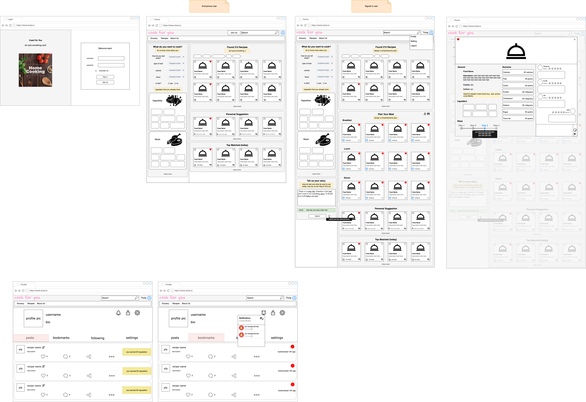
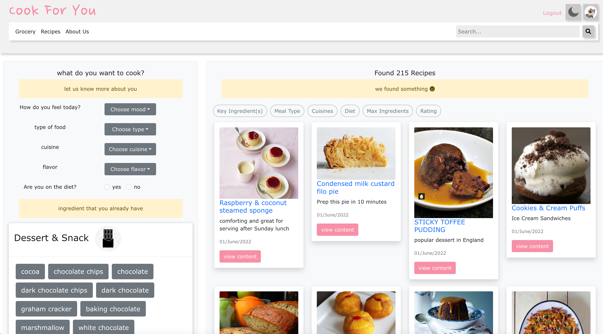

# Team profile

## Team Name 
We have two goals; build a distinct and user friendly web. We want to build a web that is different from thousands of existing websites, so we chose the word ```distinct```. Fun fact, in Korea, consonants are pronounced without being distracted by any obstacle; on the other hand, vowels are pronounced with a crushing tongue, mouth, or throat. Since we want to create a web application that users can enjoy without being distracted by unnecessary features and works smoothly without complications, we ended up with the name ```dstnct```. 

## Personal Information
**Yunjae Kim** | **Student ID**: s3891941 | **Email**: s3891941@rmit.edu.vn
<hr/>
  I am Yunjae Kim, and my student number is s3891941. I used to study physics and work at a biophysics lab. In the lab, we used computer simulation to understand how proteins evolve, function as well as study a broad range of biological systems. It blew my mind that this simulator not only leads me to see the actual transformation, but also allows me to experiment in a much easier way, and furthermore calculate approximate data. I started to fall in love with it and decided to study more about it. 
I am pretty new in the field, so I do not have much experience. I took basic programming classes, but most importantly, through this semester, I studied programming, database management systems, and gained IT knowledge overall. I am interested in programming and artificial intelligence. I want to build an online lecture platform. Personally, I had many ups and downs while I chose my major and struggled studying myself. Hence, I want to make a platform that supports people to lightly try what they want and also dig into their passion in an easier way.  
I love hiking. I climbed more than 300 mountains during the pandemic. I love the fresh air and peaceful environment in the mountains. The view I see in the middle of the rock climbing cannot compare with any other experiences. I cannot wait to get away from this pressure and go back to the mountain soon!.

<br/>
<br/>

**Pham Hoang Long** |	**Student ID**: s3938007	| **Email**: s3938007@rmit.edu.vn
<hr/>
My name is Pham Hoang Long, student number s3938007. I grew up like any ordinary kid, in a small town far away from the city. I used to play badminton a lot back in the day, but now, I’m more into playing video games and learning computer stuff. IT wasn’t my thing until 12th when I realized my love for it, especially in competitive programming, and application building. I love learning new things every day, to see how this IT world is running. I have some experience in programming, mostly self-study, take part in some programming contests, and build some bots. But still, I’m a newbie to this world of IT. My goal is to one day build myself a game that will become renowned, and build useful applications for myself and others in need.

<br/>
<br/>

**Van Phuong Ha Vy** |	**Student ID**: s3903509	| **Email**: s3903509@rmit.edu.vn
<hr/>
I’m Vy. Student number s3903509. I like to romanticize my life by reading Donna Tartt at a cafe or laying down on the floor in the dark. I’m insanely meticulous about certain things and slack off on other things, and I do not get to choose which. I have absolutely no experience in IT (or programming), and at this point I’ve realized that I probably have no interest in it either. I’m a fickle person, and I don’t have a lot of hobbies that I can make a career out of, or don’t like them long enough to do anything about it. I’ve changed my mind about what I want to do many times throughout high school, and the only reason why I chose IT is because I thought it would be easy and fun, as long as I make good money. Wrong. I didn’t necessarily think I’d enjoy IT per se, but I would never in a million years think I could dislike something this much. It didn’t take a lot for me to figure that this wasn’t the path for me either. Once you know, you know, you know?

<br/>
<br/>

**Do Phan Nhat Anh**	| **Student ID**: s3915034	| **Email**: s3915034@rmit.edu.vn
<hr/>
	My name is Do Phan Nhat Anh, student number s3915034. Growing up I was always very inquisitive. I had many interests, usually inspired by my family members. My father introduced me to the world of business. I grew an interest in business after traveling alongside my father on his business trips. I’ve read a lot of books on successful entrepreneurs and how their processes helped their business expand over time. However, I also gained interest in designing which was inspired by my cousin’s magnificent artworks. During my free time, I asked her to show me how to develop my sketching skills. She has taught me many things along the way. IT was not my interest until my gap year when my parents introduced me to their software company. I soon grew an interest in computers and was satisfied with the futuristic technologies, and realized my passion for it, especially web development, and team projects. As my interest is growing more profound and passionate with every new discovery I make and using artificial intelligence in daily life to see the wonders of the internet, technology has left me fascinated with just how much mystery they hold. I have some knowledge in coding, such as web designing using HTML5, and CSS/SASS or Bootstrap 5, through taking part in my parent’s business projects. My goal is to pursue a career in web development, and get recruited by a big company, designing websites that’s accessible and appealing to the user.

<br/>
<br/>

**Luu Duc Trung** |	**Student ID**: s3951127 |	**Email**: s3951127@rmit.edu.vn
<hr/>
My name is Luu Duc Trung, student number s3951127. I’m a student and a part-time developer in a global money transfer company. I love to organize everything including my schedule (study and work) and my room. When solving problems, I spend time understanding every single aspect and evaluate side effects of it before I solve it. In my free time, I hang out with my friends, otherwise I choose something related to technology and programming to learn to level up my knowledge.

## Group processes
Overall, our group dynamic was good. Everyone has their own specialty and that’s what makes us stronger. Yunjae came up with the idea of a recipe website and managed the timetable. Vy designed each page and took care of the editing. Long contributed both writing and developing skills. Leon and Trung not only led the building process as the engineers, but also helped the member’s along the coding process. Although some of us do not have much technical experience, we treated each other with respect and appreciation, and that made our team work out in the best way.
Sometimes, we had communication issues and that caused conflict and delayed the process. When we were halfway through the project, Trung said we needed to be more structured with our roles and suggested we draw UI design on Draw.io. That led us to build the whole web again and we were confused. However, we communicated immediately and resolved the issue. We acknowledged the problem, agreed on a solution, and moved on. We also had meetings on a regular basis and continuously communicated on teams. We tracked each other’s work and gave helpful feedback to one another. Even though everything was so overwhelming, there was always a person for us to rely on that made us believe that we could finish the assignment on time. Eventually, that miscommunication incident made us stronger as a team and taught us how to express ourselves better to be able to work more effectively in groups. 

## Career Plans
We had similar career plans at the beginning of the semester, though not the same ones. However, our differences are what make us more capable. Trung wants to be a software engineer, so he’ll take the role of a leader and tell the developers what to do and what can be improved. Long wants to be a game/applications developer, it is certain that he’ll be good at coding the backend for the web. Anh wants to be a web developer, so he’ll be focusing on designing and structuring the website. Since Vy is interested in architecture design, it’ll be beneficial for the group as she has a designer’s mind, which means she can construct a web UI template and identify the flaws within the web page. Yunjae wanted to be a web developer but specializing in handling big data, this will be focused on planning A/B testing which is a user experience research; she has come up with a survey to ask different users and gather their preferences with feedback that would help to design a user-friendly webpage.


## Prototype



## Outcome


